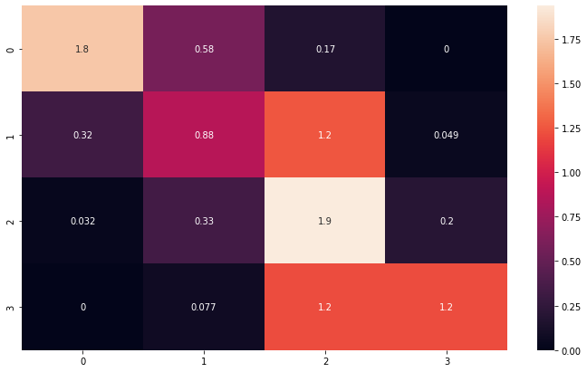
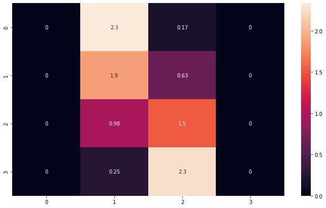
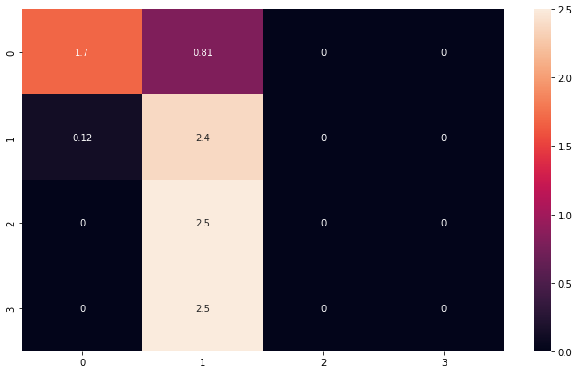
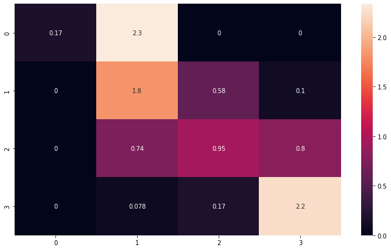
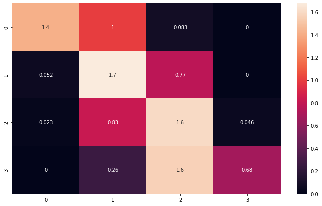
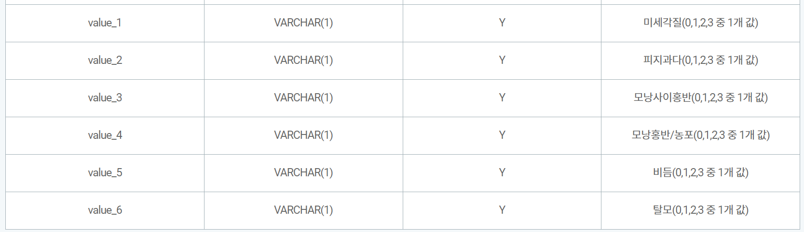
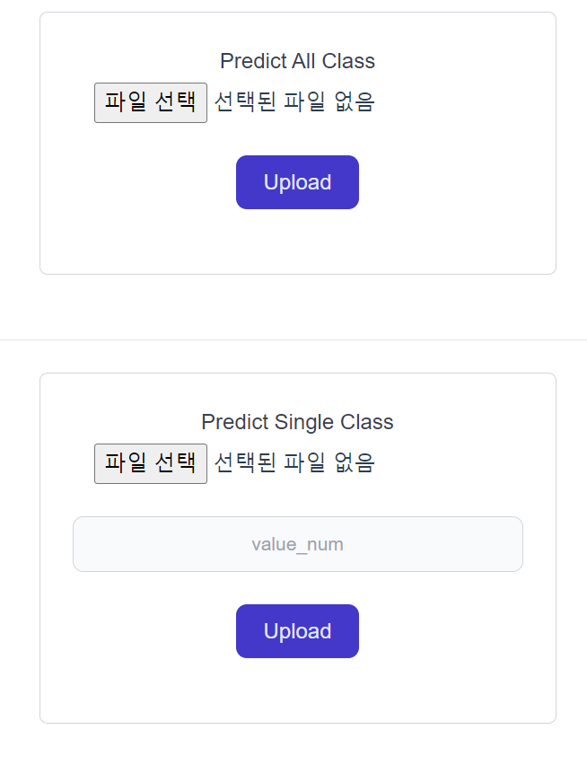

# 두피 상태 예측 AI API

## 사용 기술 스택  
 

 
 

   

## API 문서  

   

* API document https://documenter.getpostman.com/view/24010364/2s8ZDX4NXT  
  
   

## Docker Hub  

   

* docker hub https://hub.docker.com/r/baehanjin/scalp_ai_api

   

## 수행 목표
 

1.	두피 상태 6종에 대한 학습 데이터셋 생성(상태를 0~3 으로 구별)  

2.	두피 상태 6종의 상태를 target으로 하는 모델 생성(각 종 별로 모델 생성) / 여러 모델을 시험하여 가장 효율적인 모델로 생성  

3.	Flask 를 이용한 API 서버 구축(post image > return result json)  

4.	Vue를 이용한 test page 생성(axios 사용) > 빌드 경로를 flask static folder로 설정  

5.	Docker에 model 및 flask server를 담아 docker hub를 통해 배포

 

## 수행 내용  

   

1. 두피 상태 6종에 대한 학습 데이터셋 생성
   - torch transform 을 통한 augmentation
   - sklearn을 통한 train test split (label 균등)  

2. 두피 상태 6종의 상태를 target으로 하는 모델 생성
   - 시험 모델 종류: VGG / ResNet / Efficient Net / GoogleNet / VIT
   - 각모델의 confusion matrix를 비교하여 최선의 모델을 선정

3. Flask를 이용한 API 서버 구축
   - Post 방식으로 image를 보내면 모든 클래스에 대해서 결과를 json으로 return(/predict_all)
   - Post 방식으로 image 와 value_num 을 보내면 value_num 에 맞는 결과를 json으로 return(/predict)

4. Vue & axios & tailwind 를 이용한 test page
    - axios를 이용하여 POST방식으로 전송하여 API 작동 여부 확인(All Class / Single Class)

5. Docker를 통한 배포
    - 도커를 통해 어느 환경에서도 작동할 수 있게 함
    - docker hub를 통한 이미지 배포

 

## 수행 결과  

   

1. 시험 모델 종류: VGG / ResNet / Efficient Net / GoogleNet / VIT
   * Efficient Net 모델로 선정(NVIDIA/DeepLearningExamples:torchhub / pretrained = True)  
  
2. 모델 학습 결과

   * 위부터 아래로 value_1~6 의 confusion matrix

  

  * value에 따른 class_name

1. Flask 를 이용하여 API 를 구축

    * API document https://documenter.getpostman.com/view/24010364/2s8ZDX4NXT  

4. Vue & axios & tailwind 를 이용한 test_page

5. Docker를 사용한 배포 및 Docker Hub 업로드

    * Docker Hub 주소: https://hub.docker.com/r/baehanjin/scalp_ai_api 

* 모델 평가: value_4 value_2 를 제외하고는 학습이 어느정도 잘 이루어짐. value_4 와 value_2 에 대해서는 차후 모델부분 개선이 필요해 보임. 원인으로는 라벨별 데이터의 불균형으로 판단됨. **라벨별 개수를 균등**하게 하고 학습한다면 개선될 것으로 예상됨. 나머지 모델 또한 인접한 라벨에 대한 구분을 어려워 함. 하지만 어느정도의 정확성은 있어 사용가능한 것으로 보임.

## 성과 및 기대효과

- 모델 부분에서는 아쉬운 부분이 있지만 2개 class 를 제외하고는 학습이 어느정도 잘 이루어짐  

- Flask를 통해 API 화 시켜 차후 개발자들이 편하게 사용하여 서비스를 구축할 수 있을 것으로 예상  

- Docker 형태로 배포하여 환경에 상관없이 구동되는 안정성을 제공함.

- Vue 를 사용한 Front 구성은 차후 npm module을 사용하여 프로젝트를 쉽게 확장할 수 있을 것

- 미용실과 같은 두피 관련 분야에서 소비자에게 신뢰성있게 상태를 말해주는 인공지능 서비스 구축 가능